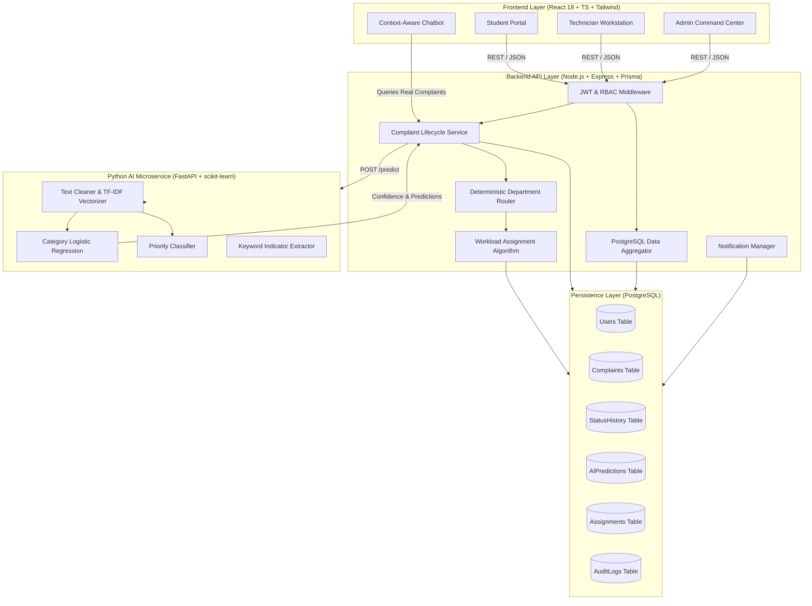

# CampusFix AI — Architecture & System Design

CampusFix AI is an intelligent campus complaint and issue resolution platform built with a modular, decoupled full-stack architecture.

## System Architecture Diagram

## Data Flow Lifecycle

1. **Submission**: Student submits complaint (`title`, `description`, `location`).
2. **Backend Validation**: Express & Zod validate parameters and check JWT identity.
3. **AI Prediction**: Backend sends text payload to FastAPI AI Service (`POST /predict`).
4. **Confidence Check**:
   - `confidence >= 0.75`: Complaint is auto-classified and routed.
   - `confidence < 0.75` or AI down: Complaint is flagged as `AI_REVIEW_REQUIRED` for Admin verification.
5. **Department Routing**: Deterministic mapping links category to database Department.
6. **Technician Assignment**: Finds available technician in department with lowest active workload.
7. **Status Transitions**: Tracks transitions (`SUBMITTED` &rarr; `ASSIGNED` &rarr; `IN_PROGRESS` &rarr; `RESOLVED` &rarr; `CLOSED` / `REOPENED`).
8. **Real-time Notifications & Audit**: Logs audit events and sends internal user notifications.
